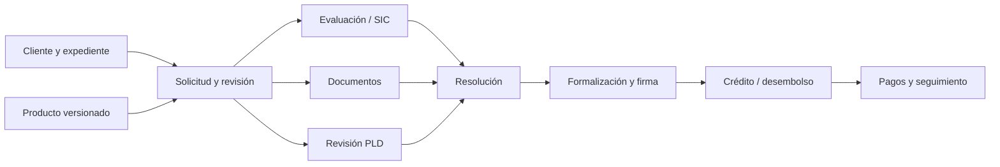

# ADR 0010: originación integrada por revisiones

- Estado: aceptado
- Fecha: 2026-09-20
- Alcance: arquitectura objetivo; implementación incremental

## Contexto

Los backlogs 04–07 comparten decisiones y evidencia; cuatro CRUD independientes
duplicarían captura y ocultarían bloqueos. Productos y documentos ya tienen
versiones inmutables (ADR 0006–0009). Equipos no son financieras (ADR 0001/0005).

## Decisión

Mantener el monolito y módulos especializados unidos por la solicitud antes del
desembolso y por el crédito después. Servicios transaccionales controlan estados;
policies y permisos controlan acceso, nunca sustituyen invariantes del dominio.
No introducir BPMN ni microservicios.

La solicitud tiene revisiones inmutables de términos, producto y evidencias.
Registrar uso de producto por `SolicitudRevision`, no por solicitud mutable:
`ProductoVersionService::registrarUso()` identifica unívocamente tipo e ID.
La sucursal se conserva históricamente aunque se traslade al cliente.
Cambios materiales crean revisión y requieren renovar decisiones dependientes.

Documentos, SIC y PLD son requisitos paralelos; no combinaciones de estados.
Aprobación individual explícita o dual configurable; ni Super Admin puede saltar
la separación dual. Contrato generado, firmado y desembolsado son hechos distintos.
No borrar clientes con evidencia operativa ni borrar historia de decisiones.

La navegación general se define en servidor y se filtra por Gate, sin roles
hardcodeados en Vue. Conservar Menubar contextual. No publicar módulos sin ruta.
Mi trabajo guía pendientes; solicitud enlaza cliente, expediente y crédito;
las bandejas especializadas no duplican las pantallas de detalle.

## Consecuencias

Primera vertical PF/MXN/crédito simple/manual, en PR pequeños. Las políticas
no definidas bloquean habilitación real, no se rellenan silenciosamente.
La especificación y secuencia P0–P10 viven en [Notion](https://app.notion.com/p/3e161db7db7f817a8c89ec30767d4666).
Eventos técnicos reutilizan ActivityLogService sin datos sensibles; timeline
operativo requiere autorización del expediente, no del visor administrativo.
