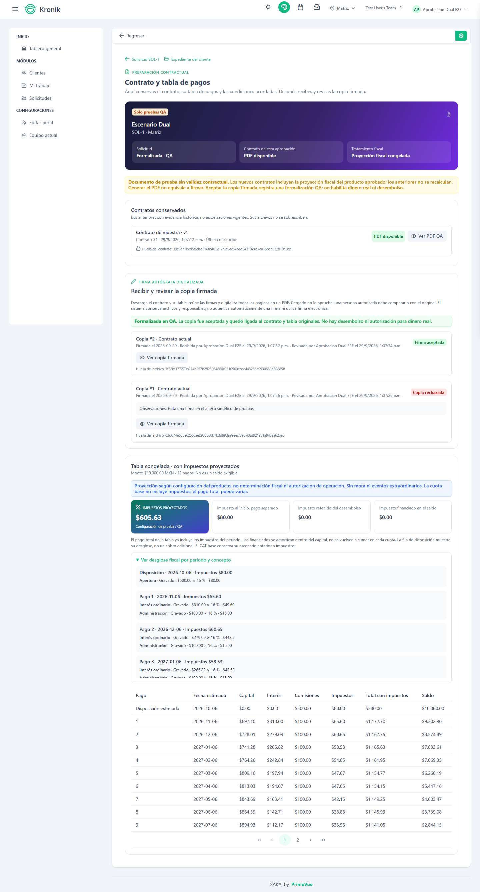

# Probar recepción y validación de firma digitalizada

Esta es una guía complementaria de [la prueba integral del crédito
simple](qa-credito-simple.md). Después de aceptar la firma, continúa con el
[desembolso QA](qa-desembolso.md).

## Qué representa

**Contrato y tabla de pagos** conserva el documento y las condiciones acordadas
de una solicitud. «Paquete» es su nombre técnico, no un módulo adicional.
Generar el PDF no significa firma. Subir una copia tampoco significa aceptación.
Un responsable autorizado la compara con el original y registra el resultado.
La recepción y revisión son QA, sin validación contractual. Este paso no mueve
dinero; el desembolso QA se registra después y tampoco ejecuta transferencias.

## Preparación

Aplicar migraciones y el seeder aditivo `ModulesAndPermissionsSeeder` mediante
el procedimiento habitual de despliegue. No usar `migrate:fresh` ni seeders E2E
en la VPS. Nueva migración: `2026_09_29_000000_create_solicitud_firmas_table`.
No modifica los contratos ni archivos anteriores.

Asignar `receive signature solicitudes` a quien recibe y `review signature
solicitudes` a quien revisa. Ambos necesitan lectura de clientes, solicitudes y
documentos; descarga requiere `download documentos`. No se asignan automáticamente.
Mantener los permisos de preparación para quien genera el original.

Habilitar `ORIGINACION_FIRMAS_QA_HABILITADAS=true` solo en QA, reconstruir caché
de configuración y reiniciar workers conforme al despliegue. Mantener las puertas
de aprobación/documentos necesarias. Límite PDF: `DOCUMENTOS_MAX_UPLOAD_KB`,
por defecto 10240 KB. Usar solo datos y firmas sintéticos; no modificar el escenario
manual que el usuario ya revisó.

## Recorrido y resultados esperados

1. Aprobar solicitud PF con revisión manual permitida. Abrir **Contrato y tabla
   de pagos**, preparar original con impuestos y esperar PDF disponible.
2. Consultar y descargar original. Preparar una copia sintética digitalizada con
   todas las páginas y tabla. Adjuntar el mismo original debe rechazarse.
3. **Recibir copia firmada**: PDF y fecha entre generación del original y hoy;
   confirmar QA. Fecha futura/antigua, formato falso, falta de confirmación o
   archivo demasiado grande muestran error español y conservan captura.
4. Tras recibir, estado de solicitud sigue **Aprobada**. Aparece pendiente de
   revisión con fecha, actor y hash. Doble envío no crea otra copia; mientras
   esté pendiente no puede recibirse otra.
5. Como revisor, abrir **Revisar firma**. Comparar original y copia en el visor.
   Elegir rechazo, explicar corrección y confirmar QA. Motivo obligatorio;
   historial conserva copia rechazada. No se formaliza.
6. Recibir copia corregida. Revisor compara páginas, identidad, condiciones y
   firmas; marca ambas confirmaciones y acepta. Resultado **Formalizada · QA**,
   copia aceptada y huellas conservadas. Repetir aceptación no duplica el registro.
7. Lector no recibe ni revisa. Receptor sin permiso de revisión no acepta.
   Sin descarga, el visor no ofrece descargar. Sin lectura de solicitud,
   URLs directas de evidencia deniegan acceso. Cambiar sucursal bloquea mutaciones,
   también para Super Admin. Archivo de otra solicitud devuelve 404.
8. En escenarios separados cambiar expediente, vencer aprobación o alterar/perder
   un archivo en almacén controlado. Aceptar debe bloquearse sin formalización.
   Recuperar desde respaldo, no editar huellas ni desactivar validaciones.
9. Devolver solicitud formalizada para corregir condiciones. Firma/registro
   anteriores siguen históricos. Nueva aprobación requiere otro original y firma.
   Cancelar conserva igualmente evidencia. No se puede editar o borrar historia.
10. Contrato P4a anterior a impuestos: puede consultarse, pero no admitir firma.
    La ayuda explica nueva revisión/aprobación sin transformar el histórico.

## Verificación para desarrollo

Backend y E2E deben ejecutarse secuencialmente en esta instalación:

```sh
php artisan test --filter=firma
npm run test:unit
npm run build
```

```powershell
$env:E2E_ORIGINACION_DUAL='true'
npm run test:e2e -- solicitudes-dual.spec.js
Remove-Item Env:\E2E_ORIGINACION_DUAL
```

El runner usa su SQLite/almacén aislados. La copia E2E es sintética y solo prueba
el flujo, no reconocimiento de firmas. El guion principal integra las etapas
posteriores de desembolso y pagos QA.

## Evidencia visual sintética

Capturas del recorrido automatizado: una copia rechazada y otra aceptada,
con sus responsables y el contrato original conservados.



[Vista móvil sin desbordamiento horizontal](../assets/firma-qa-mobile.png).
